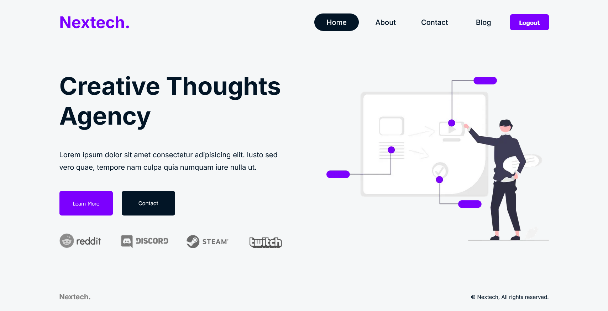

# Nextech

A company website made with NextJS.

| Preview                              |
| ------------------------------------ |
| *Homepage*<br/>   |
| *About Page*<br/> |

---

## Requirements

- npm >= 10.7.0

- node >= 20.12.2

---

## Environment Variables

- Create an GitHub OAuth App and "Authorization callback URL" will be: `http://localhost:3000/api/auth/callback/github`

- Now, you will need to create and add the following environment variables to your `.env` file

`mongoDB=YOUR_MONGO_DATABASE_URL`

`AUTH_SECRET=ANY_SECRET_KEY`

`AUTH_URL=http://localhost:3000/api/auth`

`GITHUB_ID=YOUR_GITHUB_OAUTH_APP_CLIENT_ID`

`GITHUB_SECRET=YOUR_GITHUB_OAUTH_APP_SECRET_KEY`

---

## Installation

Open `cmd` or `bash` in the project directory.

```bash
npm install
```

## Run Locally

```bash
npm run dev
```

## License

[MIT](https://choosealicense.com/licenses/mit/)
